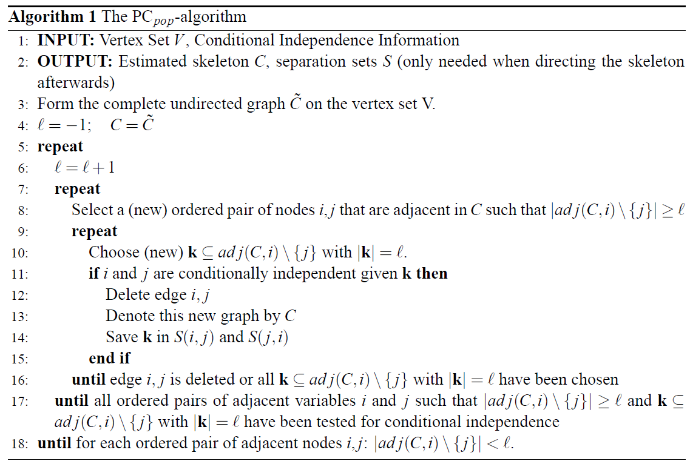
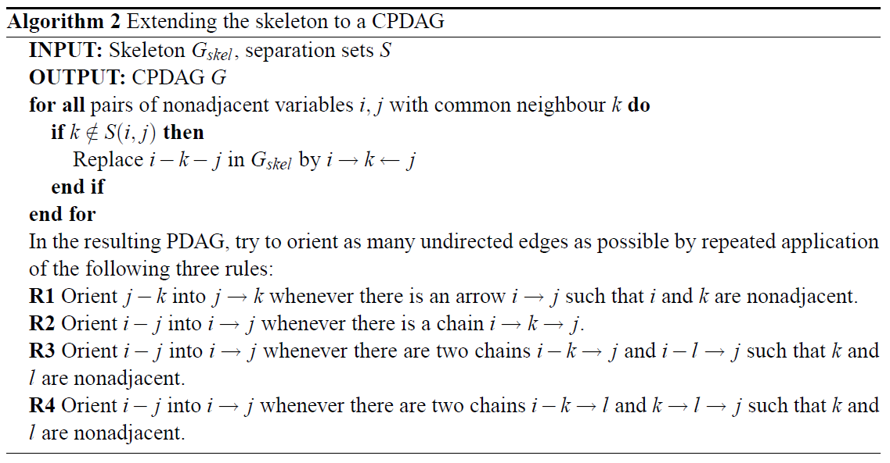

# PC

## 1. 算法介绍

图形模型是分析和可视化随机变量之间条件独立性关系的流行概率工具。模型的主要构建块是节点，它们表示随机变量和边，它们编码封闭顶点的条件依赖关系。随机变量之间的条件独立性结构可以使用马尔可夫性质来探索。

有向无环图（DAG），包含有向边而不是无向边，在某种意义上限制了条件依赖关系。这些图可以通过应用有向马尔可夫属性来解释。当忽略DAG的方向时，我们得到DAG的骨架。一般来说，它不同于条件独立性图（CIG），骨架可以很容易地解释，从而对数据的依赖结构产生有趣的见解。

PC算法是由Peter和Clark提出并以他们名字命名的贝叶斯网络结构学习方法。

## 2. 算法原理

由于DAG空间的巨大，从数据中估计DAG是困难的，而且在计算上也不平凡：可能的DAG数量随着节点的增加呈超指数增长。然而，对于节点数量较少或中等的问题，有相当成功的搜索和评分方法。例如，搜索空间可以限制在MWST中的树，或者使用贪婪的搜索。贪婪的DAG搜索可以通过利用概率等价关系来改进，搜索空间可以从单个DAG减少到等价类，如GE中提出的。虽然这种方法在节点数量很少或中等时似乎相当有希望，但它受到了这样一个事实的限制，即等价类的空间也被推测为随着节点的增加呈超指数增长。

PC算法从一个完整的无向图开始，并根据条件独立性决策递归删除边。这产生了一个无向图，然后可以部分定向并进一步扩展以表示基础DAG。

详细的原理介绍请参考 [PC算法的原文](https://www.jmlr.org/papers/volume8/kalisch07a/kalisch07a.pdf) 。

### 2.1 基本思想

- 变量之间的图结构的学习（无向图学习）

  > 首先创建完全无向图，然后基于d-分离以及独立性或条件独立性假设检验等统计方法给出的变量之间的独立性，砍掉相应的边，从而获得变量间的无向图。

- 图结构中方向的推断（有向边学习）

  > 依赖于V-结构(V-Structure)等局部结构特性确定部分边的方向。

### 2.2 搜索流程

PC算法主要由两部分组成：

1. **无向图学习**

   

2. **有向边学习**

   

## 3. 使用指导

### 3.1 使用示例

#### API模式

```python
import pandas as pd
from castle.algorithms import PC

x = pd.read_csv('x.csv').values # x.csv 是观测数据，行-表示样本，列-表示特征

pc = PC(alpha=0.05)
pc.learn(data=x)

print(pc.causal_matrix) # 打印 学到的因果图（矩阵）
```

#### 工具模式

1. 在 .yaml文件中进行参数配置，配置示例如下：

   ```yaml
   dataset_params:
     x_file: None  # None or .npz or .csv
     dag_file: None  # None or .npz or .csv
   
   model_params:
     alpha: 0.05 # Significance level
   ```

2. 执行如下命令：

   ```shell
   python run.py -m pc -c example/pc/pc.yaml
   ```

   \-m :  表示模型  -model

   \-c ：表示配置文件路径  -config

### 3.2 算法输出

PC算法会输出模型的实例，可通过访问 PC.causal_matrix 查看模型所学到的因果图矩阵。

