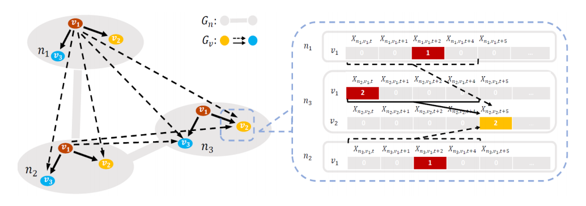
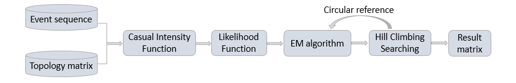
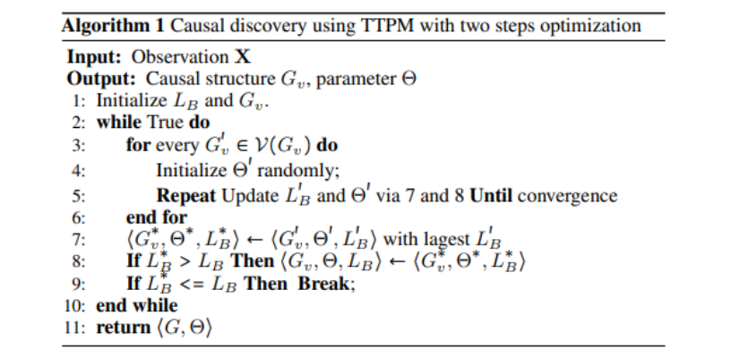
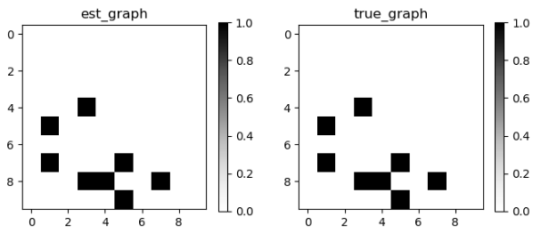

# TTPM

## 1. 算法介绍

一些现有的事件序列因果发现方法，主流的基于 Multivariate Hawkes processes，如MLE-SGL(MLE-SGL, ICML2016) 等，其缺点是未考虑事件背后的拓扑结构，仅是通过点过程对顺序事件数据建模；但在许多真实世界中，事件往往发生在拓扑结构的某个节点上，如果忽略事件背后的拓扑结构，得到的结果可能是不稳定、易受攻击的。如下图：在移动网络中的真实报警场景中，节点n3中的告警v2受到节点n1、n2、n3中的告警v1的因果关系影响，但它们的影响强度各不相同，这取决于拓扑距离.



因此，在传统Hawkes processes的基础上，引入事件所发生节点的拓扑结构图，来发现时间序列事件之间的因果结构，会得到更为稳定可靠的结果.

## 2. 算法原理

算法主要包括以下几部分：



#### 2.1 因果强度函数

用于计算事件之间的影响强度值.

为了从序列事件及其相应的拓扑结构图中捕捉到因果关系，我们假设类型为V的事件，在节点n处的每个时间间隔 ∆t 内的发生遵循一个泊松过程，为了简单起见，进一步限制拓扑对事件类型之间因果机制的影响主要取决于节点之间的拓扑距离，于是有如下公式：


#### 2.2 似然函数

用于搜索因果结构的评分标准.

设 M = <Gv, ∅> 表示事件集合的因果模型，模型M在观测集合X上的对数似然性可表示为：


#### 2.3 两步优化函数

- ##### 估计函数:

  结合给定的因果结构，使用EM算法计算似然模型L(M; X)的最大上边界值.

- ##### 搜索函数:

  结合估计函数计算的似然模型L(M; X)的最大上边界值，使用Hill-Climbing算法搜索最佳因果结构，过程如下： 

    

  初始化一个因果结构Gv，并调用估计函数计算其相应的似然值；

  通过无限循环迭代搜索最佳因果结构：每一次迭代过程中，对因果结构Gv执行一次边的添加、删除或反 转，调用估计函数对新的因果结构进行计算，得到新似然值；

  用新似然值与前一轮似然值进行比较，若前者大于后者，则保留最新似然值及因果结构；直至新似然值小于等于前一轮似然值，则结束循环，此时得到的因果结构即为最佳因果结构.

## 3. 使用指导

运行算法可通过两种方式实现：脚本模式、配置文件模式.

- ####  脚本模式：

  在运行算法前，请先细读安装指导信息，确保环境能满足算法运行要求.

  另需确保输入算法的时间序列事件数据集为pd.DataFrame类型，且包含三个字段：event（事件）、timestamp（时间戳）、node（节点）.

  ```python
  from castle.common import GraphDAG
  from castle.metrics import MetricsDAG
  from castle.datasets import DAG, Topology, THPSimulation
  from castle.algorithms import TTPM
  
  
  # 生成模拟数据
  true_causal_matrix = DAG.erdos_renyi(n_nodes=10, n_edges=10)
  topology_matrix = Topology.erdos_renyi(n_nodes=20, n_edges=20)
  simulator = THPSimulation(true_causal_matrix, topology_matrix,
                            mu_range=(0.00005, 0.0001),
                            alpha_range=(0.005, 0.007))
  X = simulator.simulate(T=25000, max_hop=2)
  
  # 模型实例化及学习
  ttpm = TTPM(topology_matrix, max_hop=2)
  ttpm.learn(X)
  print(ttpm.causal_matrix)
  
  # 可视化真实因果矩阵，及算法估计的因果矩阵
  GraphDAG(ttpm.causal_matrix.values, true_causal_matrix)
  
  # 计算准确率
  ret_metrix = MetricsDAG(ttpm.causal_matrix.values, true_causal_matrix)
  print(ret_metrix.metrics)
  ```

- #### 配置模式：

  命令如：python run.py -m ttpm -c example/ttpm/ttpm.yaml

  在example/ttpm/目录下，ttpm.yaml配置了命令行运行代码所需的信息，其配置如下：

  ```python
  dataset_params:
    x_file: None  # None or .csv, 时间序列事件数据集，可为None，也可为数据存储路径.
    dag_file: None  # None or .npz or .csv，可为None或者真实因果矩阵存储路径.
                    # 若用csv文件存储，则文件中不能包含表头，存储矩阵值即可.
    topology_file: None # None or .npz or .csv, 可为None，或拓扑邻接矩阵值的存储路径.
                        # 若用csv文件存储，则文件中不能包含表头，存储矩阵值即可.
  
  model_params:
    delta: 0.1 # 时间函数衰减系数.
    epsilon: 1 # BIC惩罚系数.
    max_hop: 2 # 最大拓扑距离.
    penalty: 'BIC' # 惩罚方式.
  ```

## 4. API

#### 4.1 参数说明：

- ##### tensor

  learn()方法参数，时间序列事件数据集，其结构如下：

  | event | timestamp | node |
  | :---: | :-------: | :--: |
  |   0   |    402    |  0   |
  |   1   |    240    |  1   |
  |   2   |   2243    |  2   |
  |   3   |   2676    |  3   |
  |   4   |    89     |  0   |

- ##### topology_matrix

  邻接矩阵值，用于生成拓扑结构图.

- ##### epsilon：

  似然函数中用于计算惩罚系数大小，该值越大，惩罚系数越大.

- ##### delta：

  时间变化函数：∅(t) = exp(−δt)中的δ，用于控制时间函数的变化率；从直觉上来看，两个事件发生之间的时间间隔越长，则事件之间独立性的可能性越高；因此，该参数值可控制时间函数的变化率，而时间函数用于计算事件之间的影响强度，也即是说，该参数可用于改变事件之间的影响值.

- ##### max_hop：

  某个事件如v1，在某个节点如n1受到事件v2在三个不同的节点，如n1, n2, n3的影响，但他们之间的影响强度是不同的，这取决于它们之间的拓扑距离；该参数可理解为：算法内计算事件之间因果强度时，需考虑的最大拓扑距离.

- ##### penalty：

  似然函数中，惩罚项选择，有'AIC'和'BIC'两种选择；’BIC'为Bayesian Information Criterion(BIC)，相较于‘AIC’，增加了一项k*log(m)/2，用于防止生成过多冗余的因果边.

#### 4.2 结果输出：

- ##### 结果可视化

  左侧为算法估算结果，右侧为真实因果:

   

- ##### 结果评估

  ```python
  {'fdr': 0.0, 'tpr': 1.0, 'fpr': 0.0, 'shd': 0, 'nnz': 8}
  ```

  指标说明：

  > *fdr: (reverse + false positive) / prediction positive*  
  > *tpr: (true positive) / condition positive*  
  > *fpr: (reverse + false positive) / condition negative*  
  > *shd: undirected extra + undirected missing + reverse*  
  > *nnz: prediction positive*
