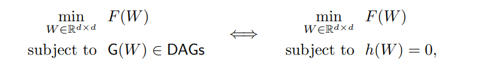
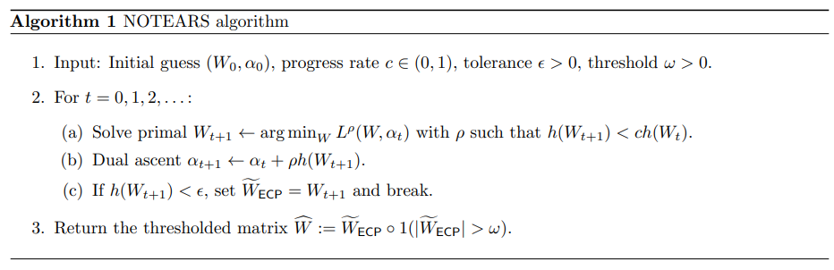
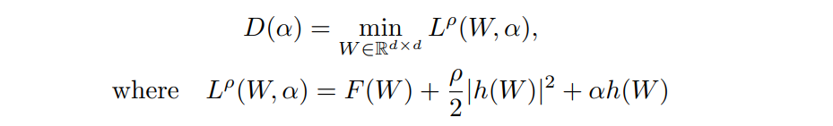
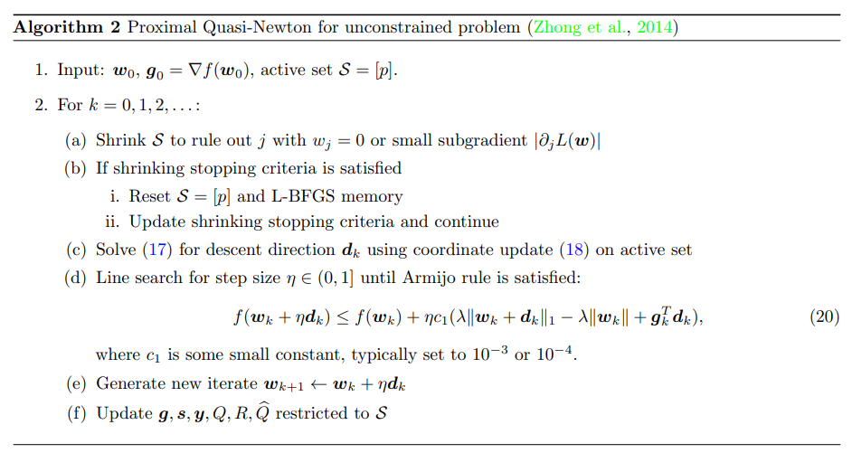

## NOTEARS: Non-combinatorial Optimization via Trace Exponential and Augmented lagRangian for Structure learning

### 1. 算法介绍

估计有向无环图（DAG，也称为贝叶斯网络）的结构是一个具有挑战性的问题，因为DAG的搜索空间是组合的，并且随着节点数量的超指数缩放。现有的方法依赖于各种局部探索来强制无环约束。本算法中，引入了一个不同的策略：将结构学习问题表述为一个完全避免这种组合约束的实矩阵上的纯连续优化问题。替代了传统的组合约束的方式，可以通过优化反复迭代后，得到DAG。

### 2. 算法原理

NOTEARS 是基于分数的DAG学习方法，将传统的组合优化问题（左）转换为连续程序（右）。虽然左右两侧的问题是等价的，但右边的连续程序消除了对专门算法（为DAG的组合空间上搜索而量身定制）的需要。相反，我们很容易实现利用标准数值算法来处理约束问题，而不需要任何关于图形模型的知识。



其中G(W)是由加权邻接矩阵W定义的d节点图，将约束 G(W)∈DAGs 改为：h(W)=0，并且规定 h(W)=0 应该满足4个条件：

> (a) 只有在 W 是 DAG 的情况下，h(W)=0  
> (b) h 的参数约束了 DAG  
> (c) h 是实矩阵上的平滑函数  
> (d) h 可求导的  

#### 2.1 基本概念

基本DAG学习问题的表述如下：设 **X**∈R(*n×d*) 是由随机向量 *X=(X1, ... , Xd)* 的 *n* 个独立同分布(IID)观测值组成的数据矩阵。D 表示 DAGs *G=(V, E)* 在 d 节点上的（离散）空间。给定 **X**，我们寻求学习联合分布 P(*X*) 的 DAG G∈D（也称为贝叶斯网络）。我们通过加权邻接矩阵 *W*∈R(*d×d*) 定义结构方程模型(SEM)对 *X* 进行建模。因此，我们将在 *R(d×d)* 上操作，即 *d×d* 实矩阵的连续空间，而不是离散空间 *D*。


#### 2.2 学习策略

##### 2.2.1 建立非循环表征

定理1: 矩阵 *W∈R(d×d)* 是 DAG，当且仅当:


其中，h(W) 的简单梯度满足前面 (a)-(d) 的所有需求：


定理1建立了非循环性的平滑代数表征，且该表征是可计算的。

##### 2.2.2 等式约束优化

我们概述了求解算法。它包括三个步骤：

> (i) 将约束问题转换为无约束子问题序列  
> (ii) 优化无约束子问题  
> (iii) 阈值  

完整算法在 Algorithm 1 中概述:



- **用增强拉格朗日求解ECP**

首先，拉格朗日乘子 *α* 的对偶函数及增强的拉格朗日：



目标是找到解决双重问题的本地解决方案


- **求解无约束子问题**

增强的拉格朗日将约束问题转换为无约束问题序列，无约束子问题可以被认为是实向量上的典型最小化问题：


*f(w)* 是目标的平滑部分。我们的目标是高精度地解决上述问题，使 *h(W)* 可以被充分抑制。

在 *λ=0* 的特殊情况下，非平滑项消失，问题简单地变成了无约束的平滑最小化，为此，许多有效的数值算法可用，例如L-BFGS。在每个步骤 k，关键的思想是通过光滑项的二次近似找到下降方向：


当 *λ>0* 时，问题变成复合最小化，采用近似拟牛顿（PQN）方法：



- **阈值**

在回归问题中，通过硬阈值对系数的后处理估计可以证明减少错误发现的数量。我们将边缘权重阈值如下：在获得的固定点 *W(ECP)* 后，给定固定阈值 *ω>0*，将绝对值中小于 *ω* 的任何权重设置为零。该策略还具有“四舍五入”增强拉格朗日数值解的重要效果，因为由于数值精度，可以容忍机器精度附近的一些小偏差（例如 10e-8），而不是严格的 *h(W(ECP))=0* 。

### 3. 使用指导

#### 3.1 参数说明

```yaml
Parameters
----------
    lambda1: float
        l1 penalty parameter
    loss_type: str
        l2, logistic, poisson (three types of loss)
    max_iter: int
        max num of dual ascent steps
    h_tol: float
        exit if |h(w_est)| <= htol
    rho_max: float
        exit if rho >= rho_max
    w_threshold: float
        drop edge if |weight| < threshold
```

#### 3.2 执行配置

调用算法有两种模式实现：API 模式、工具模式。

##### 3.2.1 API 模式

示例文件：`example/notears/notears_demo.py`

```python
from castle.algorithms import Notears
from castle.datasets import load_dataset
from castle.common import GraphDAG
from castle.metrics import MetricsDAG

true_dag, X = load_dataset(name='iid_test')
n = Notears()
n.learn(X)
GraphDAG(n.causal_matrix, true_dag)
met = MetricsDAG(n.causal_matrix, true_dag)
print(met.metrics)
```

##### 3.2.2 工具模式

配置文件：`example/notears/notears.yaml`

```yaml
dataset_params:
  x_file: None
  dag_file: None

model_params:
  lambda1: 0.1
  loss_type: 'l2'
  max_iter: 100
  h_tol: !!float 1e-8
  rho_max: !!float 1e+16
  w_threshold: 0.3
```

执行文件：`run.py`

```bash
python run.py -m notears -c example/notears/notears.yaml
```

#### 3.3 结果输出

预测结果与真实因果图：


```python
{'fdr': 0.0, 'tpr': 1.0, 'fpr': 0.0, 'shd': 0, 'nnz': 20}
```

指标说明：

> *fdr: (reverse + false positive) / prediction positive*  
> *tpr: (true positive) / condition positive*  
> *fpr: (reverse + false positive) / condition negative*  
> *shd: undirected extra + undirected missing + reverse*  
> *nnz: prediction positive*  
